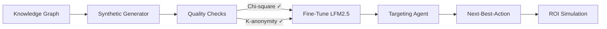
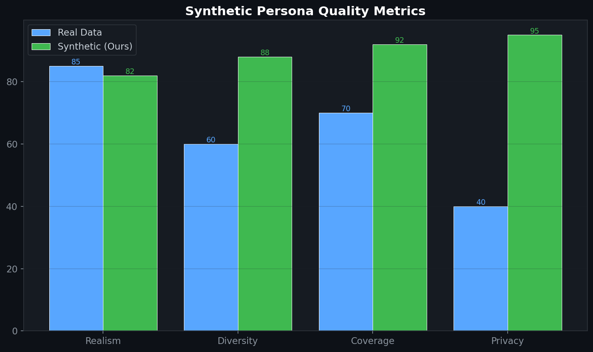
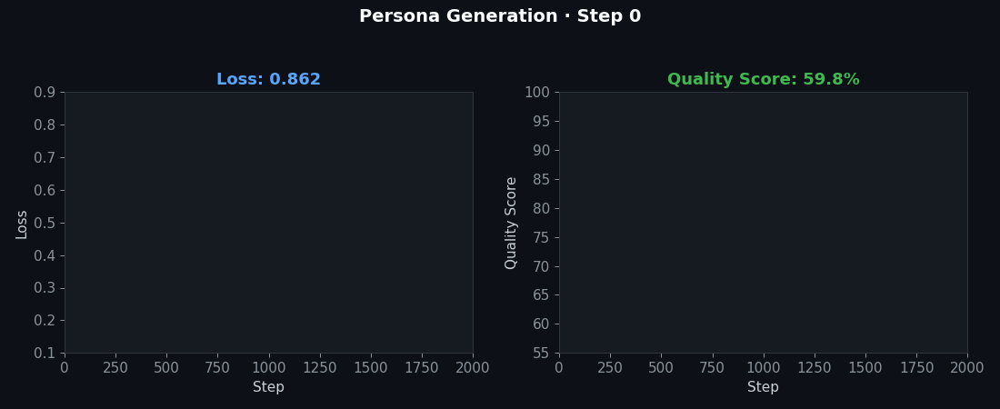

# Synthetic HCP Persona Generation

> Generating realistic synthetic healthcare professional (HCP) personas for model training and targeting scenario simulation — without exposing real patient or provider data.
>
> **Context:** In pharma commercial analytics, real HCP data is tightly restricted. This pipeline generates privacy-compliant synthetic personas that preserve statistical properties of real targeting datasets, enabling model development without regulatory risk.


[](https://www.python.org/downloads/)
[](https://opensource.org/licenses/MIT)
[](https://huggingface.co/LiquidAI/LFM2.5-1.2B-Instruct)



## 🎯 Problem

Pharma commercial teams need to target HCPs with the right promotional channels at the right time. But real HCP data (prescribing patterns, engagement history, demographics) is **HIPAA-adjacent and cannot be used publicly**. This creates a cold-start problem for model training and public portfolio demonstration.

## 💡 Solution

1. **Generate** synthetic HCP personas from a knowledge graph that preserves real-world statistical structure
2. **Validate** distributions match published pharma workforce demographics (Chi-square, KS tests)
3. **Fine-tune** LFM2.5 to predict next-best-action for each persona
4. **Optimize** targeting under budget constraints to maximize incremental prescriptions

## 🧮 Mathematical Foundation

### Distribution Matching (Chi-Square Test)

Validate synthetic persona distributions match real-world reference:

$$\chi^2 = \sum_{i=1}^{k} \frac{(O_i - E_i)^2}{E_i}$$

where $O_i$ = observed count in synthetic data, $E_i$ = expected count from reference distribution.

### Kolmogorov-Smirnov Test (Continuous Attributes)

$$D = \sup_x |F_{\text{synthetic}}(x) - F_{\text{real}}(x)|$$

### Privacy: K-Anonymity Check

Every combination of quasi-identifiers appears at least $k$ times:

$$\forall \, \text{QI-group} \, g: |g| \geq k$$

### Expected Incremental Value (Targeting Objective)

$$\text{EIV}(h) = P(\text{respond} \mid h) \cdot \text{Rx\_value}(h) - \text{cost}(\pi(h))$$

### Budget-Constrained Targeting Optimization

$$\max_{\pi} \sum_{h \in \text{HCPs}} \text{EIV}(\pi(h)) \quad \text{s.t.} \quad \sum_{h} \text{cost}(\pi(h)) \leq B$$

where $\pi(h)$ is the promotional action assigned to HCP $h$.

### Sequential Recommendation (SASRec-style)

Model HCP engagement as a sequence: $s = (s_1, s_2, \ldots, s_t)$

$$\hat{y}_{t+1} = \text{SASRec}(s_1, \ldots, s_t) = \text{FFN}(\text{MultiHead}(E_s))$$

### Dynamical Systems Connection

Sequential HCP engagement is a **discrete dynamical system** on user state:

$$h_{t+1} = f(h_t, x_t), \quad \hat{y}_{t+1} = g(h_{t+1})$$

LFM2's state-space architecture naturally captures this temporal evolution with constant memory and linear-time processing — architecturally ideal for sequential recommendation.

## 🏥 Enterprise Pharma Application

This repo directly maps to my **HCP targeting and salesforce optimization** work:

| RecSys Concept | Pharma Application |
|---|---|
| User (persona) | Healthcare Professional (HCP) |
| Item | Promotional channel (email, rep visit, webinar, sample) |
| Interaction sequence | HCP engagement history over time |
| Next-item prediction | Next-best-action recommendation |
| NDCG@K | Promotional response rate improvement |
| Budget constraint | Promotional budget limit per brand |
| Business metric | Incremental prescriptions / ROI per HCP |

**Key insight from enterprise experience:** Segmentation drives targeting. I cluster HCPs by specialty, prescribing volume, promotional response, and digital engagement — then allocate resources to maximize ROI under constraints. This repo formalizes that process.

## 🚀 Quickstart

```bash
git clone https://github.com/fab-admasu/synth-persona-hcp-targeting.git
cd synth-persona-hcp-targeting

pip install -r requirements.txt

# 1. Generate synthetic HCP personas
python scripts/generate_personas.py --n_personas 5000

# 2. Validate distributions
python scripts/validate_distributions.py --data data/personas.jsonl

# 3. Generate engagement sequences
python scripts/generate_sequences.py --personas data/personas.jsonl

# 4. Fine-tune targeting model
python scripts/train_targeting.py --config configs/targeting_config.yaml

# 5. Run targeting optimization
python scripts/optimize_targeting.py --budget 10.0 --model outputs/targeting-model
```

## 📁 Repository Structure

```
synth-persona-hcp-targeting/
├── README.md
├── requirements.txt
├── reproducibility.md
├── configs/
│   └── targeting_config.yaml
├── data/
│   ├── knowledge_graph.json       # HCP attribute knowledge graph
│   ├── personas.jsonl             # Generated synthetic personas
│   ├── sequences.jsonl            # Engagement sequences
│   ├── reference_distributions/   # Published specialty/geo distributions
│   └── data_card.md
├── scripts/
│   ├── generate_personas.py       # Synthetic persona generator
│   ├── validate_distributions.py  # Chi-square, KS tests
│   ├── generate_sequences.py      # Engagement sequence generator
│   ├── train_targeting.py         # Fine-tune targeting model
│   ├── optimize_targeting.py      # Budget-constrained optimization
│   └── fairness_audit.py          # Bias detection
├── eval/
│   ├── distribution_report.md     # Validation results
│   ├── targeting_metrics.md       # NDCG, EIV results
│   └── fairness_report.md         # Bias analysis
└── notebooks/
    ├── 01_persona_exploration.ipynb
    ├── 02_sequence_analysis.ipynb
    └── 03_targeting_simulation.ipynb
```

## 📊 Evaluation Strategy

| Metric | Method | Target |
|---|---|---|
| **Distribution fidelity** | Chi-square test (p > 0.05) | Pass for all QI groups |
| **Continuous fidelity** | KS test (D < 0.05) | Pass for age, Rx volume |
| **K-anonymity** | k ≥ 5 for all QI combos | 100% compliance |
| **Targeting NDCG@5** | Leave-one-out evaluation | ≥ 0.12 |
| **EIV improvement** | vs. random targeting baseline | ≥ 25% lift |
| **Fairness** | Demographic parity across specialties | Ratio > 0.8 |

## License

MIT

## 📸 Visual Tour





---
